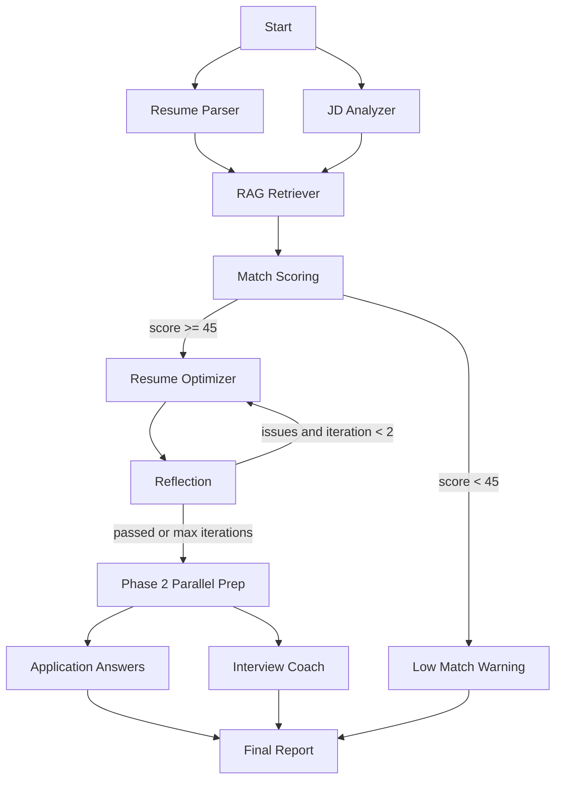

# CareerPilot AI

> A LangGraph-based Multi-Agent RAG System for Resume-JD Matching and Internship Application Preparation.

## What Makes This Different from a Prompt Wrapper

CareerPilot AI uses a real workflow rather than one long prompt:

- Conditional routing sends low-fit jobs to a warning path and skips resume optimization.
- A reflection node checks generated bullets for unsupported claims and can loop back to the optimizer.
- A local RAG knowledge base supplies resume bullet templates, STAR examples, and skill taxonomy snippets, chunked per section so an AI role and a backend role retrieve different material.
- Evaluation metrics make the output measurable.

## Problem Statement

Students applying for AI, data, and software internships need help understanding how well their resume fits a JD and how to rewrite existing experience without fabricating claims.

## Key Features

- Resume parsing from pasted text, TXT, PDF, and DOCX.
- JD analysis for required skills, preferred skills, responsibilities, and keywords.
- Match scoring with low-match branching.
- Resume bullet suggestions grounded in the existing resume.
- Reflection review for factual consistency.
- Conservative application answer starters, optional application questions, and interview practice questions.
- Parallel execution where the workflow allows it: resume parsing and JD analysis at intake, application answers and interview coaching after reflection.
- Compare one resume against several job descriptions at once, ranked by fit, with the skills missing from every role.
- Export the full report as Markdown.
- Local Streamlit UI, workflow trace, and SQLite-backed run history summaries.
- Comparison evaluation across Baseline, LLM-only, and CareerPilot Full methods.

## Tech Stack

- Python 3.11+ recommended
- Streamlit
- LangGraph
- Pydantic
- DeepSeek OpenAI-compatible API
- ChromaDB optional local vector store through `langchain-chroma`, used when `EMBEDDING_PROVIDER=openai` supplies real embeddings; with the default hash embeddings the deterministic term-overlap retriever ranks better and is used instead

## Architecture Diagram



## Setup Instructions

```powershell
python -m venv .venv
.venv\Scripts\Activate.ps1
pip install -r requirements.txt
Copy-Item .env.example .env
```

Edit `.env`:

```env
DEEPSEEK_API_KEY=your_key_here
DEEPSEEK_BASE_URL=https://api.deepseek.com
DEEPSEEK_MODEL=deepseek-v4-pro
DEEPSEEK_THINKING=disabled
DEEPSEEK_REASONING_EFFORT=low
EMBEDDING_PROVIDER=local_hash
DEEPSEEK_REQUEST_TIMEOUT=60
DEEPSEEK_MAX_RETRIES=2
```

`DEEPSEEK_REQUEST_TIMEOUT` and `DEEPSEEK_MAX_RETRIES` are optional. Raise the timeout when using thinking mode with high reasoning effort, which is considerably slower than the defaults.

The project can still run deterministic fallback logic without an API key. For deeper but slower analysis, switch `DEEPSEEK_THINKING=enabled` and choose `DEEPSEEK_REASONING_EFFORT=low`, `medium`, or `high`.
The Streamlit sidebar also exposes thinking mode and reasoning effort controls for local demos.

## How To Run

```powershell
streamlit run app.py
```

For the local project virtual environment:

```powershell
cd D:\CareerPilot_AI
.\.venv\Scripts\Activate.ps1
python -m streamlit run app.py
```

Open `http://localhost:8501`, click `Load Sample Data`, optionally add application questions, then click `Run CareerPilot Analysis`. For the fastest demo, keep `Thinking Mode` set to `disabled` and `Reasoning Effort` set to `low`.
If an old result still shows fallback traces, rerun the analysis; the app now versions cache keys so pre-fix cached workflow states are not reused.

If the browser says the site refused to connect, restart Streamlit and try `http://127.0.0.1:8501`:

```powershell
cd D:\CareerPilot_AI
.\.venv\Scripts\Activate.ps1
python -m streamlit run app.py --server.address 127.0.0.1 --server.port 8501
```

## Demo Screenshots

Input screen with the provider settings and all seven tabs:


Sample resume and AI Intern job description loaded through the sidebar:


Match report, with the Markdown export button:


One resume compared against three roles, ranked by fit:


These are captured on the deterministic path, so anyone can regenerate the identical images and no API credit is spent. That is why the sidebar shows the fallback notice rather than a configured key.

```powershell
node tools\capture_streamlit_screenshot.mjs
```

Add `--live` to capture real model output instead. A live capture freezes one model run, and the model scores 15-20 points below the deterministic scorer (see Limitations), so the deterministic default is the more representative picture as well as the reproducible one.

## Tests And Linting

```powershell
python -m pytest -q
ruff check .
```

Tests run against the deterministic fallback path and never require an API key. GitHub Actions runs both on Python 3.11 and 3.12.

## Evaluation

```powershell
python eval/run_eval.py
```

Evaluation runs deterministically by default: it clears the DeepSeek credentials and forces markdown retrieval, so repeated runs produce byte-identical CSVs and cost nothing. Pass `--live` to call the real model instead, which costs money and returns different numbers each run.

```powershell
python eval/run_eval.py --live
```

The script writes `outputs/evaluation_results.csv` with one row per case and method, `outputs/evaluation_comparison_summary.csv` with method-level averages, `outputs/scoring_calibration.csv` with synthetic score-monotonicity checks, and `outputs/evaluation_ablation_results.csv` with single-component RAG/reflection ablations. Metrics include keyword coverage, score components, bilingual action/result and STAR proxies, evidence coverage, interview coverage, RAG execution, reflection review, and workflow structure.

The deterministic match score uses a fixed, inspectable 100-point rubric: required skills 40, preferred skills 10, relevant project evidence 25, relevant work evidence 15, and education requirements 10. Projects and work entries earn credit only from evidence in their own text. If the JD parser cannot identify required skills, the score is marked provisional and cannot trigger the low-match cutoff.

## Safety And Privacy

- This tool assists but never automates job applications.
- Uploaded files are processed in memory and are not saved.
- Run history stores summary metadata only; raw resumes and job descriptions are not persisted.
- API keys are loaded from `.env`.
- AI-generated content must be reviewed and personalized before submitting.
- Visa, work authorization, sponsorship, salary, legal eligibility, and compensation answers must be filled by the user.

## Limitations

- The AI score remains an approximate assessment and is shown beside the deterministic rubric when they differ. Workflow routing and multi-JD ranking use the stable rule-based score, so an anomalous model score cannot prematurely stop generation. A 20-point disagreement still raises a warning.
- The bundled calibration suite checks monotonic behavior, not human agreement. Absolute calibration, MAE, and rank correlation require a larger human-labelled resume/JD set.
- Deterministic RAG/reflection ablations can prove that components ran and whether proxy metrics changed; they do not by themselves establish real-model quality gains.
- Fallback parsing is simple and intended for offline demos.
- RAG uses deterministic local retrieval unless optional vector-store dependencies are installed.
- Model quality depends on the configured DeepSeek model.

## Future Work

- Optional demo GIF.
- Synonym-aware retrieval needs a real embedding model. DeepSeek exposes no embeddings endpoint, so this requires either an OpenAI key (`EMBEDDING_PROVIDER=openai`, which enables the Chroma path automatically) or a local sentence-transformer.

## Resume Bullet For This Project

Built CareerPilot AI, a LangGraph-based multi-agent system with conditional routing, a reflection loop for factual resume optimization, local RAG knowledge retrieval, parallel application/interview preparation, and evaluation metrics, delivered as a Streamlit application.
