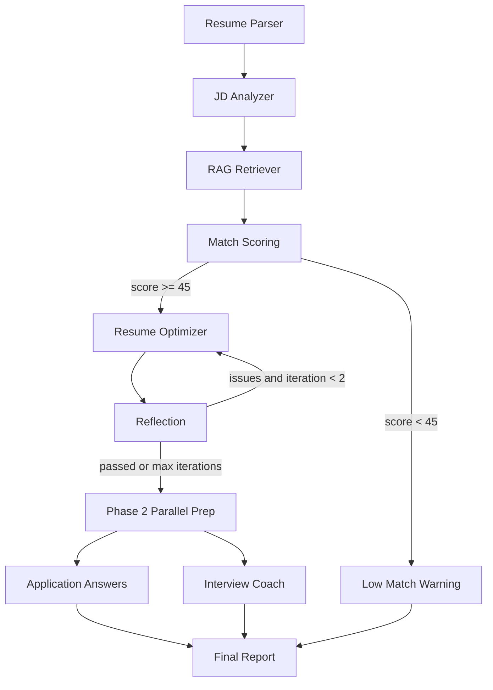

# CareerPilot AI

> A LangGraph-based Multi-Agent RAG System for Resume-JD Matching and Internship Application Preparation.

## What Makes This Different from a Prompt Wrapper

CareerPilot AI uses a real workflow rather than one long prompt:

- Conditional routing sends low-fit jobs to a warning path and skips resume optimization.
- A reflection node checks generated bullets for unsupported claims and can loop back to the optimizer.
- A local RAG knowledge base supplies resume bullet templates, STAR examples, and skill taxonomy snippets.
- Evaluation metrics make the output measurable.

## Problem Statement

Students applying for AI, data, and software internships need help understanding how well their resume fits a JD and how to rewrite existing experience without fabricating claims.

## Key Features

- Resume parsing from pasted text, TXT, PDF, and DOCX.
- JD analysis for required skills, preferred skills, responsibilities, and keywords.
- Match scoring with low-match branching.
- Resume bullet suggestions grounded in the existing resume.
- Reflection review for factual consistency.
- Conservative application answer starters, optional application questions, and interview practice questions.
- Parallel Phase 2 preparation so application answers and interview coaching run independently after reflection.
- Local Streamlit UI and workflow trace.

## Tech Stack

- Python 3.11+ recommended
- Streamlit
- LangGraph
- Pydantic
- DeepSeek OpenAI-compatible API
- ChromaDB optional local vector store through `langchain-chroma`

## Architecture Diagram



## Setup Instructions

```powershell
python -m venv .venv
.venv\Scripts\Activate.ps1
pip install -r requirements.txt
Copy-Item .env.example .env
```

Edit `.env`:

```env
DEEPSEEK_API_KEY=your_key_here
DEEPSEEK_BASE_URL=https://api.deepseek.com
DEEPSEEK_MODEL=deepseek-v4-pro
DEEPSEEK_THINKING=disabled
DEEPSEEK_REASONING_EFFORT=low
EMBEDDING_PROVIDER=local_hash
```

The project can still run deterministic fallback logic without an API key. For deeper but slower analysis, switch `DEEPSEEK_THINKING=enabled` and choose `DEEPSEEK_REASONING_EFFORT=low`, `medium`, or `high`.
The Streamlit sidebar also exposes thinking mode and reasoning effort controls for local demos.

## How To Run

```powershell
streamlit run app.py
```

For the local project virtual environment:

```powershell
cd D:\CareerPilot_AI
.\.venv\Scripts\Activate.ps1
python -m streamlit run app.py
```

Open `http://localhost:8501`, click `Load Sample Data`, optionally add application questions, then click `Run CareerPilot Analysis`. For the fastest demo, keep `Thinking Mode` set to `disabled` and `Reasoning Effort` set to `low`.
If an old result still shows fallback traces, rerun the analysis; the app now versions cache keys so pre-fix cached workflow states are not reused.

If the browser says the site refused to connect, restart Streamlit and try `http://127.0.0.1:8501`:

```powershell
cd D:\CareerPilot_AI
.\.venv\Scripts\Activate.ps1
python -m streamlit run app.py --server.address 127.0.0.1 --server.port 8501
```

## Evaluation

```powershell
python eval/run_eval.py
```

The script writes `outputs/evaluation_results.csv`. Metrics include keyword coverage before and after generated bullets, required skill match rate, reflection revision rate, STAR-ready bullet coverage, application answer evidence coverage, sensitive-question refusal count, interview prep-notes coverage, project follow-up count, role-specific question count, and required-skill evidence question count.

## Safety And Privacy

- This tool assists but never automates job applications.
- Uploaded files are processed in memory and are not saved.
- API keys are loaded from `.env`.
- AI-generated content must be reviewed and personalized before submitting.
- Visa, work authorization, sponsorship, salary, legal eligibility, and compensation answers must be filled by the user.

## Limitations

- Fallback parsing is simple and intended for offline demos.
- RAG uses deterministic local retrieval unless optional vector-store dependencies are installed.
- Model quality depends on the configured DeepSeek model.

## Future Work

- Demo GIF and richer README screenshots.
- Full baseline vs LLM-only vs CareerPilot evaluation.
- SQLite run history.

## Resume Bullet For This Project

Built CareerPilot AI, a LangGraph-based multi-agent system with conditional routing, a reflection loop for factual resume optimization, local RAG knowledge retrieval, parallel application/interview preparation, and evaluation metrics, delivered as a Streamlit application.
